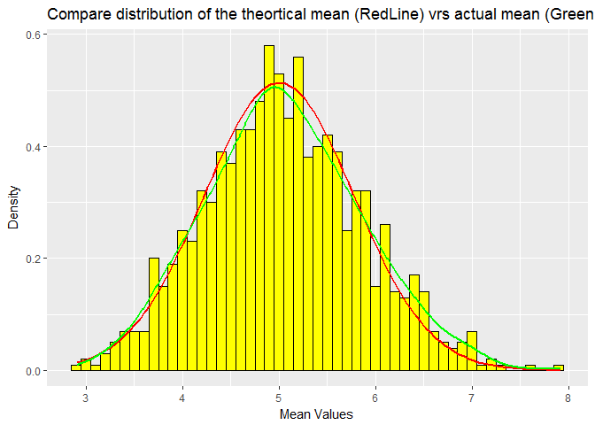
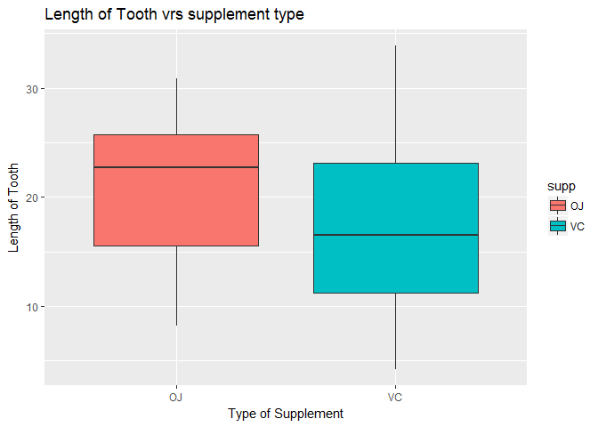
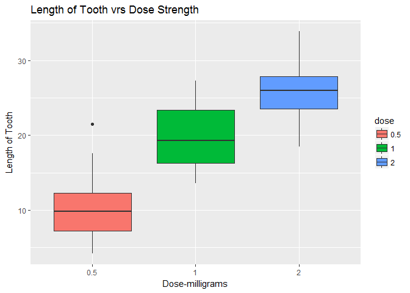

OVERVIEW
========

This project has two parts:
---------------------------

### Part 1: Simulation Exercise Instructions

#### In this project you will investigate the exponential distribution in R and compare it with the Central Limit Theorem. The exponential distribution can be simulated in R with rexp(n, lambda) where lambda is the rate parameter. The mean of exponential distribution is 1/lambda and the standard deviation is also 1/lambda. Set lambda = 0.2 for all of the simulations. You will investigate the distribution of averages of 40 exponentials. Note that you will need to do a thousand simulations.

### Part 2: Basic Inferential Data Analysis

#### In the second portion of the project, we're going to analyze the ToothGrowth data in the R datasets package.

Part 1 - SIMULATION
===================

### Part 1: Simulation Exercise Instructions

#### 1) Illustrate via simulation and associated explanatory text the properties of the distribution of the mean of 40 exponentials. You should Show the sample mean and compare it to the theoretical mean of the distribution.

##### Setup work environment

    ## Warning: package 'knitr' was built under R version 3.3.3

    ## Warning: package 'ggplot2' was built under R version 3.3.3

    ## Warning: package 'dplyr' was built under R version 3.3.3

    ## 
    ## Attaching package: 'dplyr'

    ## The following objects are masked from 'package:stats':
    ## 
    ##     filter, lag

    ## The following objects are masked from 'package:base':
    ## 
    ##     intersect, setdiff, setequal, union

##### Make a dataframe of a 1000 rows of 40 observations (n=40) - lamda=.2 and find mean values for each row

    a1<- rexp(40000,.2)
    m1<- matrix(a1,1000)
    d1<-tbl_df(m1)
    mean1<-apply(d1,1,mean)

##### Look at theortical and actual: mean, standard deviation and variance. Note that the theortical mean is 1/lamda or 5. The actual mean is computed below. Note that the difference between the theortical mean and the actual mean is very small.

    mean_actual<-mean(mean1)
    mean_actual

    ## [1] 5.048536

##### Let's graph the mean as a density histogram for the 1000 rows of observations

    meandf<-data.frame(mean1)
    g<-ggplot(meandf, aes(x=mean1))
    plotmean<-g + geom_histogram(binwidth = .1,fill="yellow",color="black")+labs(x="Mean Values", y="Frequency",title="Simulated distribution of the mean for 1000 rows of 40 exponentials")
    plotmean

#### 2) Show how variable the sample is (via variance) and compare it to the theoretical variance of the distribution.

##### The theortical SD is 1/lamda\*1/sqrt(n)=.7905694. The actual SD is computed below. Note that the difference between the theortical SD and the actual SD is very small. The theortical variance is SD^2 = .7905694^2 = .625. The actual variance is also computed below. Note that the difference between the theortical variance and the actual variance is also small.

    sd_actual<-sd(mean1)
    sd_actual

    ## [1] 0.8081609

    var_actual<-var(mean1)
    var_actual

    ## [1] 0.6531241

#### 2) Show how variable the sample is (via variance) and compare it to the theoretical variance of the distribution and 3) Show that the distribution is approximately normal. Let's compare simulated means with a stat\_fuction line using theortical mean of 5 and theortical sd of .625.

    g2<-ggplot(meandf, aes(x=mean1) )

    plot2<- g2 +geom_histogram(binwidth=.1,fill="yellow",color="black",aes(y=..density..))+labs(x="Mean Values", y="Density",title="Compare distribution of the theortical mean (RedLine) vrs actual mean (GreenLine)") + stat_function(fun = dnorm, args = list(mean=5,sd=.7776059),color="red",size=1) + stat_density(geom="line",color="green",size=1) 
    plot2

#### Note that the theortical and actual are similar

Part 2: Basic Inferential Data Analysis of "ToothGrowth data"
=============================================================

First load data
---------------

    library(tidyr)

    ## Warning: package 'tidyr' was built under R version 3.3.3

    data("ToothGrowth")
    dtooth<-ToothGrowth
    dftooth<-tbl_df(dtooth)

### Overview/summary of "ToothGrowth"

    summary(dftooth)

    ##       len        supp         dose      
    ##  Min.   : 4.20   OJ:30   Min.   :0.500  
    ##  1st Qu.:13.07   VC:30   1st Qu.:0.500  
    ##  Median :19.25           Median :1.000  
    ##  Mean   :18.81           Mean   :1.167  
    ##  3rd Qu.:25.27           3rd Qu.:2.000  
    ##  Max.   :33.90           Max.   :2.000

    dftooth

    ## # A tibble: 60 × 3
    ##      len   supp  dose
    ##    <dbl> <fctr> <dbl>
    ## 1    4.2     VC   0.5
    ## 2   11.5     VC   0.5
    ## 3    7.3     VC   0.5
    ## 4    5.8     VC   0.5
    ## 5    6.4     VC   0.5
    ## 6   10.0     VC   0.5
    ## 7   11.2     VC   0.5
    ## 8   11.2     VC   0.5
    ## 9    5.2     VC   0.5
    ## 10   7.0     VC   0.5
    ## # ... with 50 more rows

### Find mean of supply mode:

    df2<-group_by(dtooth,supp)
    df3<-df3<-summarize(df2,length=mean(len))
    df3

    ## # A tibble: 2 × 2
    ##     supp   length
    ##   <fctr>    <dbl>
    ## 1     OJ 20.66333
    ## 2     VC 16.96333

### Plot 3 - Tooth size vrs kind of supplement used

    g3<-ggplot(dftooth, aes(x=supp,y=len))
    plot3<-g3+geom_boxplot(aes(fill=supp))+labs(x="Type of Supplement", y="Length of Tooth", title="Length of Tooth vrs supplement type")
    plot3

### Plot 4 - Tooth size vrs Vitamin Dose

    dftooth$dose<-as.factor(dftooth$dose)
    g4<-ggplot(dftooth, aes(x=dose,y=len))
    plot4<-g4+geom_boxplot(aes(fill=dose))+labs(x="Dose-milligrams", y="Length of Tooth", title="Length of Tooth vrs Dose Strength")
    plot4

### Use confidence intervals to compare tooth growth by supp.

    t.test(dftooth$len[dftooth$supp=="OJ"], dftooth$len[dftooth$supp=="VC"], paired = FALSE, var.equal = FALSE)$conf.int

    ## [1] -0.1710156  7.5710156
    ## attr(,"conf.level")
    ## [1] 0.95

#### The above confience interval contains 0 therefore we can conclude that the supplement type has no impact on tooth growth

### Use confidence intervals to compare tooth growth by dose.

    t.test(dftooth$len[dftooth$dose==2], dftooth$len[dftooth$dose==1], paired = FALSE, var.equal = FALSE)$conf.int

    ## [1] 3.733519 8.996481
    ## attr(,"conf.level")
    ## [1] 0.95

#### The above confience interval does not contain 0 therefore we can conclude that the supplement type does impact on tooth growth - the higher dose has higher growth rate.
