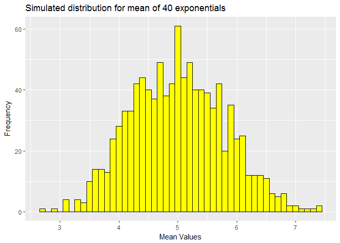
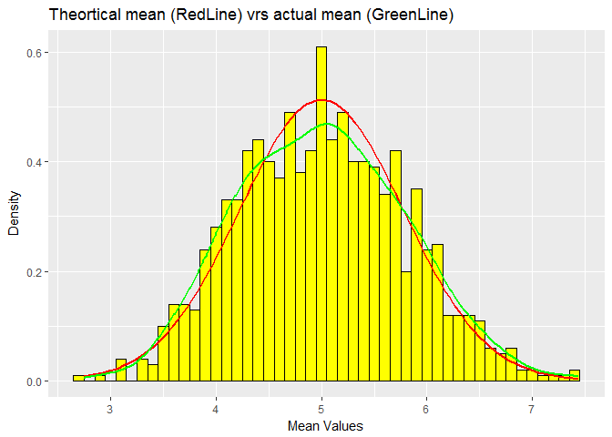

OVERVIEW
========

Part 1: Simulation Exercise Instructions
----------------------------------------

#### In this project you will investigate the exponential distribution in R and compare it with the Central Limit Theorem. The exponential distribution can be simulated in R with rexp(n, lambda) where lambda is the rate parameter. The mean of exponential distribution is 1/lambda and the standard deviation is also 1/lambda. Set lambda = 0.2 for all of the simulations. You will investigate the distribution of averages of 40 exponentials. Note that you will need to do a thousand simulations.

### Part 1: Simulation

#### 1) Illustrate via simulation and associated explanatory text the properties of the distribution of the mean of 40 exponentials. You should Show the sample mean and compare it to the theoretical mean of the distribution.

##### Setup work environment

    ## Warning: package 'knitr' was built under R version 3.3.3

    ## Warning: package 'ggplot2' was built under R version 3.3.3

    ## Warning: package 'dplyr' was built under R version 3.3.3

    ## 
    ## Attaching package: 'dplyr'

    ## The following objects are masked from 'package:stats':
    ## 
    ##     filter, lag

    ## The following objects are masked from 'package:base':
    ## 
    ##     intersect, setdiff, setequal, union

##### Make a dataframe of a 1000 rows of 40 observations (n=40) - lamda=.2 and find mean values for each row

            a1<- rexp(40000,.2)
            m1<- matrix(a1,1000)
            d1<-tbl_df(m1)
            mean1<-apply(d1,1,mean)

##### Look at theortical and actual: mean, standard deviation and variance. Note that the theortical mean is 1/lamda or 5. The actual mean is computed below. Note that the difference between the theortical mean and the actual mean is very small.

            mean_actual<-mean(mean1)
            mean_actual

    ## [1] 5.001198

##### Let's graph the mean as a density histogram for the 1000 rows of observations

            meandf<-data.frame(mean1)
            g<-ggplot(meandf, aes(x=mean1))
            plotmean<-g +geom_histogram(binwidth=.1,fill="yellow",color="black")+
            labs(x="Mean Values", y="Frequency",
            title="Simulated distribution for mean of 40 exponentials")
            plotmean

#### The theortical SD is 1/lamda\*1/sqrt(n)=.7905694. The actual SD is computed below. Note that the difference between the theortical SD and the actual SD is very small. The theortical variance is SD^2 = .7905694^2 = .625. The actual variance is also computed below. Note that the difference between the theortical variance and the actual variance is also small.

            sd_actual<-sd(mean1)
            sd_actual

    ## [1] 0.792808

            var_actual<-var(mean1)
            var_actual

    ## [1] 0.6285446

#### 2) Show how variable the sample is (via variance) and compare it to the theoretical variance of the distribution and 3) Show that the distribution is approximately normal. Let's compare simulated means with a stat\_fuction line using theortical mean of 5 and theortical sd of .625.

            g2<-ggplot(meandf, aes(x=mean1) )
            plot2<- g2 +geom_histogram(binwidth=.1,fill="yellow",color="black",
            aes(y=..density..))+labs(x="Mean Values", y="Density",
            title="Theortical mean (RedLine) vrs actual mean (GreenLine)")+
            stat_function(fun=dnorm,args=list(mean=5,sd=.7776059),
            color="red",size=1)+
            stat_density(geom="line",color="green",size=1) 
            plot2

#### Note that the theortical and actual are similar
