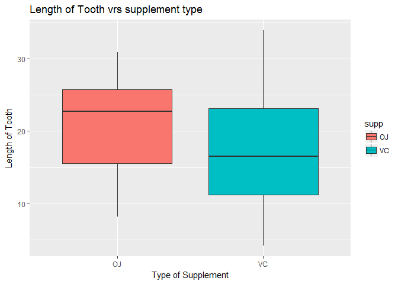
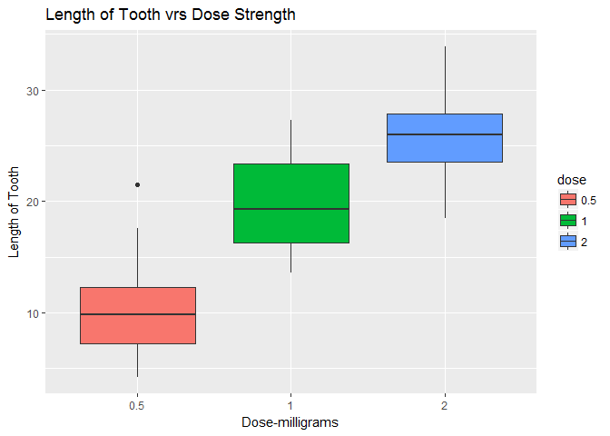

OVERVIEW PART 2
===============

### Basic Inferential Data Analysis of "ToothGrowth data"

#### In the second portion of the project, we're going to analyze the ToothGrowth data in the R datasets package.

##### Setup work environment

    ## Warning: package 'knitr' was built under R version 3.3.3

    ## Warning: package 'ggplot2' was built under R version 3.3.3

    ## Warning: package 'dplyr' was built under R version 3.3.3

    ## 
    ## Attaching package: 'dplyr'

    ## The following objects are masked from 'package:stats':
    ## 
    ##     filter, lag

    ## The following objects are masked from 'package:base':
    ## 
    ##     intersect, setdiff, setequal, union

    ## Warning: package 'tidyr' was built under R version 3.3.3

### First load data

            data("ToothGrowth")
            dtooth<-ToothGrowth
            dftooth<-tbl_df(dtooth)

### Overview/summary of "ToothGrowth"

            summary(dftooth)

    ##       len        supp         dose      
    ##  Min.   : 4.20   OJ:30   Min.   :0.500  
    ##  1st Qu.:13.07   VC:30   1st Qu.:0.500  
    ##  Median :19.25           Median :1.000  
    ##  Mean   :18.81           Mean   :1.167  
    ##  3rd Qu.:25.27           3rd Qu.:2.000  
    ##  Max.   :33.90           Max.   :2.000

            dftooth

    ## # A tibble: 60 × 3
    ##      len   supp  dose
    ##    <dbl> <fctr> <dbl>
    ## 1    4.2     VC   0.5
    ## 2   11.5     VC   0.5
    ## 3    7.3     VC   0.5
    ## 4    5.8     VC   0.5
    ## 5    6.4     VC   0.5
    ## 6   10.0     VC   0.5
    ## 7   11.2     VC   0.5
    ## 8   11.2     VC   0.5
    ## 9    5.2     VC   0.5
    ## 10   7.0     VC   0.5
    ## # ... with 50 more rows

### Find mean of supply mode:

            df2<-group_by(dtooth,supp)
            df3<-df3<-summarize(df2,length=mean(len))
            df3

    ## # A tibble: 2 × 2
    ##     supp   length
    ##   <fctr>    <dbl>
    ## 1     OJ 20.66333
    ## 2     VC 16.96333

### Plot 3 - Tooth size vrs kind of supplement used

            g3<-ggplot(dftooth, aes(x=supp,y=len))
            plot3<-g3+geom_boxplot(aes(fill=supp))+labs(x="Type of Supplement", y="Length of Tooth", title="Length of Tooth vrs supplement type")
            plot3

### Plot 4 - Tooth size vrs Vitamin Dose

            dftooth$dose<-as.factor(dftooth$dose)
            g4<-ggplot(dftooth, aes(x=dose,y=len))
            plot4<-g4+geom_boxplot(aes(fill=dose))+labs(x="Dose-milligrams", y="Length of Tooth", title="Length of Tooth vrs Dose Strength")
            plot4

### Use confidence intervals to compare tooth growth by supp.

            t.test(dftooth$len[dftooth$supp=="OJ"], dftooth$len[dftooth$supp=="VC"], paired = FALSE, var.equal = FALSE)$conf.int

    ## [1] -0.1710156  7.5710156
    ## attr(,"conf.level")
    ## [1] 0.95

#### The above confidence interval contains 0 therefore we can conclude that the supplement type has no impact on tooth growth

### Use confidence intervals to compare tooth growth by dose.

            t.test(dftooth$len[dftooth$dose==2], dftooth$len[dftooth$dose==1], paired = FALSE, var.equal = FALSE)$conf.int

    ## [1] 3.733519 8.996481
    ## attr(,"conf.level")
    ## [1] 0.95

#### The above confience interval does not contain 0 therefore we can conclude that the supplement type does impact on tooth growth - the higher dose has higher growth rate.
